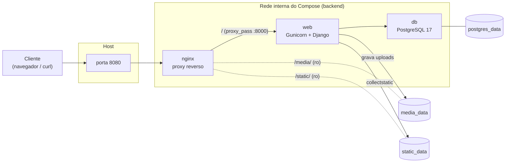

# django-upload-stack

[](https://github.com/lucasetculbra/django-upload-stack/actions/workflows/ci.yml)
[](https://github.com/lucasetculbra/django-upload-stack/actions/workflows/publish.yml)
[](https://github.com/lucasetculbra/django-upload-stack/actions/workflows/pages.yml)
[](https://lucasetculbra.github.io/django-upload-stack/)
[](LICENSE)

Ambiente completo com **Docker Compose** para uma aplicação **Django** de upload de arquivos:
servida por **Gunicorn** a partir de uma imagem própria, atrás de um **Nginx** que atua como
proxy reverso e é o único serviço com porta publicada, usando **PostgreSQL** como banco de
dados. Os arquivos enviados são gravados em um **volume nomeado** e, por isso, **não se
perdem** quando os containers são destruídos e recriados.

> Documentação completa: <https://lucasetculbra.github.io/django-upload-stack/>

---

## Arquitetura



| Serviço | Imagem | Papel | Porta no host |
|---|---|---|---|
| `nginx` | própria, a partir de `nginx:1.30-alpine` | Proxy reverso; serve `/media/` e `/static/` direto dos volumes | **8080** (única publicada) |
| `web` | própria, a partir de `python:3.13-slim` | Django 5.2 LTS servido por Gunicorn | nenhuma (`expose: 8000`) |
| `db` | `postgres:17-alpine` | Banco de dados | nenhuma |

## Pré-requisitos

- [Docker Desktop](https://www.docker.com/products/docker-desktop/) (ou Docker Engine) com Compose v2+
- Git
- Opcional, apenas para rodar os testes fora do Docker: Python 3.13+

## Subindo o ambiente

```bash
git clone https://github.com/lucasetculbra/django-upload-stack.git
cd django-upload-stack
```

Crie o arquivo `.env` a partir do exemplo e gere uma `SECRET_KEY` única:

<details>
<summary><b>Git Bash / Linux / macOS</b></summary>

```bash
cp .env.example .env
KEY=$(python -c "import secrets; print(secrets.token_urlsafe(50))")
sed -i "s|^SECRET_KEY=.*|SECRET_KEY=$KEY|" .env
```
</details>

<details>
<summary><b>PowerShell (Windows)</b></summary>

```powershell
$key = python -c "import secrets; print(secrets.token_urlsafe(50))"
$content = (Get-Content .env.example) -replace '^SECRET_KEY=.*', "SECRET_KEY=$key"
# UTF-8 sem BOM: um BOM quebraria a primeira variável lida pelo Compose
[IO.File]::WriteAllLines("$PWD\.env", $content, [Text.UTF8Encoding]::new($false))
```
</details>

Suba a stack:

```bash
docker compose up -d --build --wait
```

Acesse:

| URL | Descrição |
|---|---|
| <http://localhost:8080/> | Formulário de upload e listagem dos arquivos |
| <http://localhost:8080/healthz/> | Healthcheck em JSON (inclui o status do banco) |
| <http://localhost:8080/admin/> | Django admin (crie um usuário, veja abaixo) |

```bash
# usuário administrador (opcional)
docker compose exec web python manage.py createsuperuser

# acompanhar os logs
docker compose logs -f

# derrubar mantendo os dados
docker compose down

# derrubar APAGANDO os volumes (uploads e banco)
docker compose down -v
```

## Variáveis de ambiente

Todas são lidas do `.env` (veja `.env.example`). Referência completa em
[docs/variaveis.md](https://lucasetculbra.github.io/django-upload-stack/variaveis/).

| Variável | Obrigatória | Padrão | Descrição |
|---|---|---|---|
| `SECRET_KEY` | sim | — | Chave secreta do Django. Gere uma por ambiente e nunca versione. |
| `DEBUG` | não | `0` | `1` ativa o modo debug. Mantenha `0` fora do desenvolvimento. |
| `ALLOWED_HOSTS` | não | `localhost,127.0.0.1,web` | Hosts aceitos, separados por vírgula. |
| `CSRF_TRUSTED_ORIGINS` | não | vazio | Origens confiáveis com esquema e porta (ex.: `http://localhost:8080`). |
| `DJANGO_DB` | não | `postgres` | `postgres` (exige as variáveis abaixo) ou `sqlite` (apenas testes locais). |
| `POSTGRES_DB` | sim¹ | — | Nome do banco. |
| `POSTGRES_USER` | sim¹ | — | Usuário do banco. |
| `POSTGRES_PASSWORD` | sim¹ | — | Senha do banco. |
| `POSTGRES_HOST` | não | `db` | Host do banco (o Compose força `db`). |
| `POSTGRES_PORT` | não | `5432` | Porta do banco. |
| `MAX_UPLOAD_MB` | não | `100` | Limite de upload da aplicação. Mantenha em sincronia com `client_max_body_size`. |
| `NGINX_PORT` | não | `8080` | Porta publicada no host pelo Nginx. |
| `WEB_IMAGE` | não | `django-upload-stack-web:local` | Permite usar uma imagem pronta (ex.: do GHCR). |
| `LOG_LEVEL` | não | `INFO` | Nível de log da aplicação. |

¹ Obrigatória quando `DJANGO_DB=postgres` (o padrão). A aplicação falha na inicialização,
com uma mensagem explícita, se alguma delas faltar.

> **Atenção:** o Docker Compose interpola o `.env`. Valores não podem conter `$`, `#`,
> espaços ou aspas, e o arquivo precisa estar em UTF-8 **sem BOM**.

## Como a persistência dos uploads foi garantida

Um container é efêmero: tudo que é escrito na sua camada de escrita desaparece quando ele é
removido. Por isso, nenhum dado importante fica dentro do container:

| Volume nomeado | Montado em | Conteúdo |
|---|---|---|
| `postgres_data` | `db:/var/lib/postgresql/data` | Dados do PostgreSQL (inclusive a lista de arquivos) |
| `media_data` | `web:/app/media` (rw) e `nginx:/vol/media` (ro) | **Arquivos enviados pelos usuários** |
| `static_data` | `web:/app/staticfiles` (rw) e `nginx:/vol/static` (ro) | Arquivos estáticos do `collectstatic` |

O `MEDIA_ROOT` do Django aponta para `/app/media`, que é exatamente o ponto de montagem do
volume `media_data`; os bytes do arquivo vão para o volume e o registro (nome, tamanho, data)
vai para o PostgreSQL. Como `docker compose down` remove containers e rede, **mas não os
volumes nomeados**, ao subir novamente os dois voltam a ser montados e nada se perde.

A prova é automatizada em `scripts/smoke_test.sh` e roda também no CI:

```text
==> 5/6 recreating the stack (docker compose down, then up)
    OK   containers recreated

==> 6/6 data survived the recreation
    OK   record still listed (postgres_data volume persisted)
    OK   file still served with identical bytes (media_data volume persisted)

SMOKE TEST PASSED - uploads survive down/up
```

## Testes

```bash
# 1) Suíte local, sem banco (SQLite) - Python 3.13+
pip install -r requirements-dev.txt
pytest

# 2) Mesma suíte dentro do container, contra o PostgreSQL real
docker compose -f docker-compose.yml -f docker-compose.test.yml run --rm web

# 3) Teste ponta a ponta da stack, incluindo a prova de persistência
#    (no Windows, rode pelo Git Bash)
bash scripts/smoke_test.sh
```

Os testes cobrem o upload pela view, a gravação do arquivo em `MEDIA_ROOT`, a listagem dos
arquivos enviados, a rejeição de arquivos acima do limite e o healthcheck da aplicação.

Lint e formatação:

```bash
ruff check .
ruff format --check .
```

## Imagem publicada

A imagem da aplicação é publicada no GitHub Container Registry a cada push na `main` e a cada
tag `v*`:

```bash
docker pull ghcr.io/lucasetculbra/django-upload-stack:latest

# usar a imagem publicada em vez de construir localmente
WEB_IMAGE=ghcr.io/lucasetculbra/django-upload-stack:latest docker compose up -d
```

## Documentação

A documentação completa (arquitetura, explicação serviço a serviço do `docker-compose.yml` e
do `Dockerfile`, persistência, variáveis, CI/CD e troubleshooting) é publicada no GitHub Pages:

**<https://lucasetculbra.github.io/django-upload-stack/>**

Para rodar o site localmente:

```bash
pip install -r requirements-docs.txt
mkdocs serve
```

## Licença

[MIT](LICENSE)
