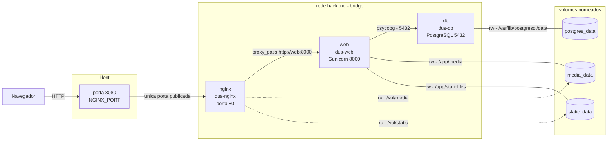
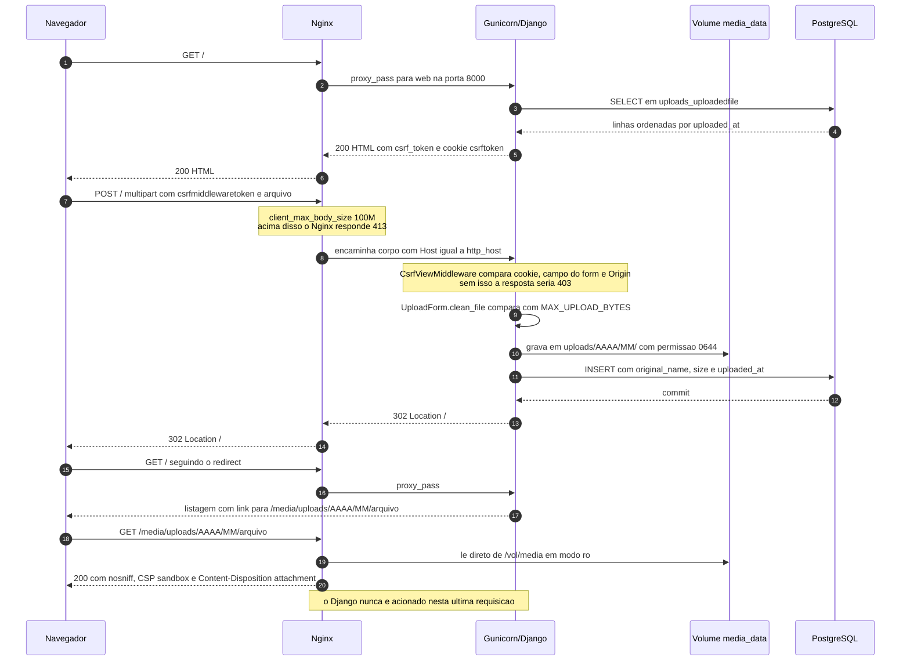
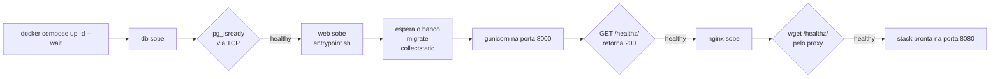

# Arquitetura

A stack tem três contêineres — `nginx`, `web` e `db` — ligados por uma única rede bridge
chamada `backend`, e três volumes nomeados (`postgres_data`, `media_data`, `static_data`)
que guardam tudo aquilo que precisa sobreviver a um `docker compose down`.

O princípio que organiza todas as decisões desta página é simples: **processo e dado são
coisas separadas**. Contêiner é descartável; volume nomeado é permanente. Quem recebe
tráfego da internet (Nginx) não é quem executa código de aplicação (Gunicorn), e quem
executa código de aplicação não é quem guarda o estado (PostgreSQL e volumes).

---

## Visão geral

O diagrama abaixo mostra o caminho completo de uma requisição, quem monta cada volume e
com qual permissão, e onde ficam as fronteiras de rede.



Linha cheia significa escrita (`rw`); linha tracejada, leitura apenas (`ro`). Repare que
não existe nenhuma seta saindo do host direto para `web` ou para `db`: a única porta
publicada é a do Nginx.

### Os três serviços

| Serviço | `container_name` | Imagem | Porta interna | Publicada no host |
| --- | --- | --- | --- | --- |
| `db` | `dus-db` | `postgres:17-alpine` | 5432 | não |
| `web` | `dus-web` | build do `Dockerfile`, stage `runtime` (`${WEB_IMAGE:-django-upload-stack-web:local}`) | 8000 (`expose`) | não |
| `nginx` | `dus-nginx` | build de `./nginx` sobre `nginx:1.30-alpine` | 80 | sim — `${NGINX_PORT:-8080}:80` |

O serviço `web` declara `expose: ["8000"]` e **não** declara `ports`. `expose` é
puramente documental no Compose moderno (contêineres na mesma rede já se enxergam em
qualquer porta), mas deixa explícito no arquivo qual porta o Gunicorn atende. O que
importa é a ausência de `ports`: sem ela, nada no host alcança o Gunicorn.

### Os três volumes

| Volume | `web` | `nginx` | `db` | O que guarda |
| --- | --- | --- | --- | --- |
| `media_data` | `/app/media` (rw) | `/vol/media` (ro) | — | arquivos enviados pelo formulário |
| `static_data` | `/app/staticfiles` (rw) | `/vol/static` (ro) | — | saída do `collectstatic` |
| `postgres_data` | — | — | `/var/lib/postgresql/data` (rw) | dados do PostgreSQL |

Os caminhos dentro de `web` não são coincidência: o `Dockerfile` define
`MEDIA_ROOT=/app/media` e `STATIC_ROOT=/app/staticfiles`, e é exatamente sobre esses dois
diretórios que os volumes são montados. Detalhes de retenção, backup e restauração estão
em [Persistência e volumes](persistencia.md).

!!! warning "A versão do PostgreSQL define o caminho do volume"
    Este projeto usa `postgres:17-alpine`, cujo `PGDATA` é `/var/lib/postgresql/data`.
    A partir do `postgres:18` o caminho recomendado muda para `/var/lib/postgresql`, e o
    mesmo `volumes:` apontando para `.../data` deixaria o banco sem persistência real.
    O comentário está registrado no próprio `docker-compose.yml`.

---

## Anatomia de um upload

Este é o fluxo que o projeto existe para demonstrar. O ponto mais importante do diagrama
é o último passo: o download do arquivo **não passa pelo Django**.



Alguns pontos que o diagrama resume e que valem ser ditos por extenso:

* **Post/Redirect/Get.** A view `index` em `uploads/views.py` responde ao POST válido com
  `redirect("uploads:index")`, ou seja, `302`. Isso evita o reenvio do formulário quando
  o usuário aperta F5 e é justamente o código que o `scripts/smoke_test.sh` verifica no
  passo 3.
* **CSRF é levado a sério.** O `smoke_test.sh` faz o mesmo POST duas vezes: sem token,
  espera `403`; com o cookie, o campo `csrfmiddlewaretoken` e os cabeçalhos `Origin` e
  `Referer`, espera `302`. É por causa desse teste que o Nginx repassa
  `proxy_set_header Host $http_host` e não `$host`: `$host` descartaria a porta e
  transformaria `localhost:8080` em `localhost`, quebrando a checagem de origem do
  Django em toda submissão de navegador.
* **Arquivos grandes não passam pela memória.** `FILE_UPLOAD_MAX_MEMORY_SIZE` é 5 MB em
  `config/settings.py`; acima disso o Django escreve o upload em arquivo temporário antes
  de movê-lo para o `MEDIA_ROOT`.
* **Dois limites, um número.** `MAX_UPLOAD_MB` (padrão 100) governa a validação em
  `UploadForm.clean_file`, e `client_max_body_size 100M` governa o Nginx. Se o do Nginx
  fosse menor, o usuário receberia um `413` cru, sem a mensagem de erro amigável do
  formulário. Ver [Variáveis de ambiente](variaveis.md).
* **O nome original é preservado.** `UploadedFile.save()` guarda `original_name` e `size`
  antes de o storage renomear o arquivo — o Django acrescenta um sufixo aleatório quando
  já existe outro com o mesmo nome.

---

## Ordem de inicialização

A ordem não é acidental nem depende de `sleep`: ela é imposta por `depends_on` com
`condition: service_healthy`, e cada etapa só libera a seguinte quando o *healthcheck*
correspondente passa.



| Etapa | Teste do healthcheck | `interval` / `timeout` | `retries` | `start_period` |
| --- | --- | --- | --- | --- |
| `db` | `pg_isready -h 127.0.0.1 -U $POSTGRES_USER -d $POSTGRES_DB` | 5s / 5s | 10 | 10s |
| `web` | `python -c` fazendo `GET http://127.0.0.1:8000/healthz/` com `Host: localhost` | 10s / 5s | 5 | 30s (`start_interval` 2s) |
| `nginx` | `wget --quiet --spider http://127.0.0.1/healthz/` | 10s / 5s | 5 | 15s (`start_interval` 1s) |

Três detalhes desses testes merecem explicação:

* **`pg_isready` com `-h 127.0.0.1`** força a verificação por TCP. Durante o primeiro
  boot, o `initdb` sobe um servidor temporário que atende apenas no socket unix; um
  `pg_isready` local responderia "pronto" antes de o banco estar realmente acessível pela
  rede, e o `web` tentaria conectar cedo demais.
* **O `Host: localhost` explícito** no healthcheck do `web` mantém a sonda válida
  independentemente de como `ALLOWED_HOSTS` estiver configurado — sem ele, uma
  configuração restritiva derrubaria o próprio healthcheck com `400 Bad Request`.
* **O healthcheck do `nginx` atravessa o proxy inteiro.** Ele pede `/healthz/`, que o
  Nginx encaminha ao Gunicorn, que por sua vez executa `SELECT 1` no PostgreSQL
  (`uploads/views.py`). "Nginx saudável" portanto significa "a cadeia toda responde". Sem
  esse healthcheck, `up --wait` retornaria enquanto o Nginx ainda está fazendo *bind* na
  porta, e a primeira requisição poderia falhar com resposta vazia — o tipo de corrida
  que quebra CI de forma intermitente.

!!! note "O entrypoint também espera, por garantia"
    Mesmo com `depends_on: db: condition: service_healthy`, o `entrypoint.sh` tenta
    conectar no PostgreSQL com `psycopg` em laço (até `DB_WAIT_ATTEMPTS`, padrão 60
    tentativas de 1s) antes de rodar `migrate --noinput` e
    `collectstatic --noinput --clear`. Isso torna a imagem utilizável fora deste
    `docker-compose.yml` — por exemplo apontando para um banco gerenciado, onde ninguém
    garante ordem nenhuma.

---

## Por que o Nginx serve `/static/` e `/media/`

Há dois motivos, e o primeiro é intransponível.

**1. Com `DEBUG=0`, o Django simplesmente não serve esses arquivos.** O atalho
`django.conf.urls.static.static()` só devolve rotas quando `DEBUG` é verdadeiro, e o
`config/urls.py` deste projeto nem o utiliza: as únicas rotas registradas são `admin/`,
`healthz/` e as de `uploads.urls`. `MEDIA_URL = "/media/"` serve apenas para *construir*
a URL que aparece no template (`{{ item.file.url }}`); quem atende essa URL é o bloco
`location /media/` do `nginx/default.conf`. Se o Nginx saísse do caminho, todo link de
arquivo devolveria `404`.

**2. Mesmo que servisse, seria desperdício.** O Gunicorn roda com `--workers 3`. Cada
byte de um arquivo servido por WSGI atravessaria o interpretador Python e ocuparia um dos
três *workers* durante todo o download — um único arquivo de 100 MB em conexão lenta
tiraria um terço da capacidade da aplicação de circulação. O Nginx resolve o mesmo
problema com `sendfile`, copiando do page cache do kernel direto para o socket, sem
passar pelo espaço de usuário, e ainda entrega de graça `Range` (download retomável),
requisições condicionais e cache — `expires 7d` para `/static/` e `expires 1h` para
`/media/`, com `access_log off` nos dois para não inflar o log com tráfego de assets.

Além de eficiente, o bloco `/media/` é deliberadamente defensivo, porque ali mora
conteúdo enviado por terceiros na **mesma origem** da aplicação:

```nginx
location /media/ {
    alias /vol/media/;
    add_header X-Content-Type-Options nosniff always;
    add_header Content-Security-Policy "default-src 'none'; sandbox" always;
    add_header Content-Disposition attachment always;
    access_log off;
    expires 1h;
}
```

Sem esses três cabeçalhos, um `.html` enviado pelo formulário seria renderizado pelo
navegador como página do próprio site — XSS armazenado com acesso ao cookie de sessão.
`nosniff` impede a adivinhação de tipo, a CSP com `sandbox` neutraliza scripts, e
`Content-Disposition: attachment` faz o navegador baixar em vez de exibir.

---

## Por que o `media_data` é montado read-only no Nginx

O Nginx é o processo mais exposto da stack: é o único que recebe bytes de fora. O papel
dele sobre os uploads é estritamente de leitura — quem escreve é o Django. Montar com
`:ro` transforma essa regra de arquitetura em uma garantia do kernel: mesmo uma
configuração errada, um `location` com `alias` mal fechado ou um Nginx comprometido não
conseguem gravar nada dentro do volume de mídia.

O valor prático é concreto: sem escrita não existe "subir um arquivo executável e depois
pedir que ele seja servido". O fluxo de gravação passa obrigatoriamente pelo
`UploadForm.clean_file`, que valida tamanho, e pelo storage do Django, que controla nome e
caminho (`upload_to="uploads/%Y/%m/"`). O mesmo vale para `static_data`: o conteúdo é
produzido pelo `collectstatic` no *entrypoint* do `web`, e ninguém mais tem motivo para
tocá-lo.

---

## Por que a ordem de montagem de um volume vazio importa

Este é o detalhe que mais custa tempo quando se erra, e ele explica por que o
`depends_on` do `nginx` aponta para `web` e não apenas para `db`.

Quando um volume nomeado é criado **vazio**, o Docker o inicializa (*seed*) copiando o
conteúdo do diretório que existe naquele ponto de montagem **na imagem do primeiro
contêiner que o monta**, inclusive dono e permissões. No `Dockerfile`:

```dockerfile
RUN groupadd --gid 1000 app \
    && useradd --uid 1000 --gid 1000 --create-home --shell /bin/sh app
...
RUN mkdir -p /app/media /app/staticfiles && chown -R app:app /app
...
USER app
```

Ou seja, `/app/media` já existe na imagem do `web`, pertencendo a `app:app` (uid/gid
1000). Se o `web` monta primeiro, o volume nasce com esse dono e o Gunicorn — que roda
como `app`, não como root — consegue gravar uploads.

Se o **Nginx** montasse primeiro, o *seed* viria da imagem dele: `/vol/media` não existe
em `nginx:1.30-alpine`, então o Docker criaria um diretório vazio pertencente a `root`.
O volume ficaria permanentemente `root:root` e o primeiro upload morreria com
`PermissionError: [Errno 13] Permission denied` — em um diretório que, a olho nu,
"existe e está lá". Por isso o `docker-compose.yml` traz:

```yaml
depends_on:
  # Also guarantees "web" mounts the media/static volumes first, so an empty volume
  # is seeded with the app user's ownership instead of root's.
  web:
    condition: service_healthy
```

!!! danger "Isso só acontece uma vez, e é permanente"
    O *seed* ocorre exclusivamente na criação do volume. Depois disso, nenhum
    `docker compose up` conserta a propriedade — nem trocar a ordem, nem reconstruir as
    imagens. A correção passa por remover o volume (`docker compose down -v`, que apaga
    os uploads) ou ajustar o dono manualmente de dentro de um contêiner. O
    [Troubleshooting](troubleshooting.md) detalha o diagnóstico.

Um complemento vem do `settings.py`: o Nginx roda como usuário `nginx`, que não é `app`.
Se os arquivos gravados pelo Django herdassem uma umask restritiva, o Nginx leria o
diretório mas não os arquivos. Daí os valores explícitos:

```python
FILE_UPLOAD_PERMISSIONS = 0o644
FILE_UPLOAD_DIRECTORY_PERMISSIONS = 0o755
```

---

## Modelo de isolamento de rede

Existe uma única rede definida, `backend`, com driver `bridge`, e os três serviços estão
nela. A superfície exposta ao host é uma só linha do `docker-compose.yml`:

```yaml
ports:
  - "${NGINX_PORT:-8080}:80"
```

Disso decorre o modelo inteiro:

* **PostgreSQL não tem `ports`.** A porta 5432 não é alcançável do host, nem de outra
  máquina da rede local. Só `web` chega ao banco, resolvendo o nome `db` pelo DNS interno
  do Docker.
* **Gunicorn não tem `ports`.** A porta 8000 só existe dentro da rede `backend`. Não há
  como contornar o Nginx e, com isso, não há como contornar `client_max_body_size`, os
  cabeçalhos de segurança do `/media/` ou os *timeouts*.
* **Uma porta publicada, uma superfície de ataque.** Todo o tráfego externo entra por
  `:8080`, onde há um servidor escrito em C especializado em lidar com clientes
  hostis, conexões lentas e corpos de requisição gigantes — e não diretamente em um
  servidor WSGI Python.
* **Nomes em vez de IPs, resolvidos a cada requisição.** O `upstream` é declarado como
  variável:

    ```nginx
    resolver 127.0.0.11 valid=10s ipv6=off;
    ...
    set $upstream http://web:8000;
    proxy_pass $upstream;
    ```

    Com `proxy_pass http://web:8000` literal, o Nginx resolveria `web` uma única vez, ao
    iniciar, e guardaria o IP para sempre. Recriar o contêiner `web` (um `docker compose
    up -d --build`, por exemplo) muda o IP e o Nginx continuaria devolvendo `502` até ser
    reiniciado à mão. Usando uma variável, a resolução acontece por requisição, contra o
    DNS embutido do Docker em `127.0.0.11`, com cache de 10s.

* **Timeouts alinhados.** `proxy_read_timeout 120s` no Nginx casa com
  `gunicorn --timeout 120`. Se o do Nginx fosse menor, o cliente receberia `504` enquanto
  o worker ainda estivesse processando — erro que some nos logs da aplicação.

### Conferindo o isolamento na prática

Comandos somente de leitura, com o stack já no ar:

=== "PowerShell"

    ```powershell
    # a porta 8080 responde pelo Nginx
    curl.exe -I http://localhost:8080/

    # a porta 8000 (Gunicorn) nao existe para o host: a conexao e recusada
    curl.exe -I --max-time 5 http://localhost:8000/

    # o PostgreSQL tambem nao esta publicado
    Test-NetConnection -ComputerName localhost -Port 5432

    # de dentro da rede backend, porem, o Gunicorn responde
    docker compose exec nginx wget -qO- http://web:8000/healthz/
    ```

=== "Git Bash"

    ```bash
    # a porta 8080 responde pelo Nginx
    curl -I http://localhost:8080/

    # a porta 8000 (Gunicorn) nao existe para o host: a conexao e recusada
    curl -I --max-time 5 http://localhost:8000/

    # quem serve /static/ e o Nginx, nao o Django
    curl -I http://localhost:8080/static/uploads/style.css

    # de dentro da rede backend, porem, o Gunicorn responde
    docker compose exec nginx wget -qO- http://web:8000/healthz/
    ```

!!! tip "Como saber quem respondeu"
    No `curl -I` de um arquivo em `/static/` ou `/media/`, o cabeçalho `Server: nginx/...`
    acompanhado de `Expires`/`Cache-Control` indica que o arquivo saiu direto do volume.
    Respostas do Django chegam sem esses cabeçalhos de expiração e, em `/media/`, ainda
    trazem `Content-Disposition: attachment` — exclusividade do bloco do Nginx.

---

## Decisões de arquitetura e o que cada uma garante

| Decisão | Onde está | Requisito que atende |
| --- | --- | --- |
| Nginx como reverse proxy e único serviço com `ports` | `docker-compose.yml`, `nginx/default.conf` | Um só ponto de entrada (`:8080`); Gunicorn e PostgreSQL inacessíveis a partir do host |
| Gunicorn com `--workers 3 --timeout 120` como servidor WSGI | `Dockerfile` (`CMD`) | Servidor de aplicação de produção no lugar do `runserver`, com concorrência real |
| `media_data` montado em `MEDIA_ROOT` | `docker-compose.yml`, `Dockerfile` | **Uploads sobrevivem a `docker compose down` + `up`** — o objetivo do exercício |
| `postgres_data` montado no `PGDATA` | `docker-compose.yml` | Os registros da tabela sobrevivem à recriação dos contêineres |
| `static_data` alimentado pelo `collectstatic` no entrypoint | `entrypoint.sh` | CSS e assets do admin disponíveis ao Nginx sem `DEBUG=1` |
| `location /media/` e `/static/` com `alias` e `expires` | `nginx/default.conf` | Arquivos servidos com `sendfile`, sem ocupar worker Python |
| Montagem `:ro` dos volumes no Nginx | `docker-compose.yml` | Menor privilégio: o processo exposto não escreve no armazenamento |
| `nosniff` + CSP `sandbox` + `Content-Disposition: attachment` | `nginx/default.conf` | Conteúdo de terceiros na mesma origem não vira XSS armazenado |
| `depends_on` + `condition: service_healthy` nos três serviços | `docker-compose.yml` | Ordem determinística de boot e *seed* correto do volume vazio |
| Healthcheck do Nginx atravessando o proxy até o banco | `docker-compose.yml` | `up --wait` só retorna quando a cadeia inteira responde |
| Usuário não-root `app` (uid/gid 1000) | `Dockerfile` | A aplicação não roda como root; propriedade previsível nos volumes |
| Build multi-stage (`builder` → `runtime` → `test`) | `Dockerfile` | Imagem final sem toolchain de build; suíte de testes na mesma base |
| `proxy_set_header Host $http_host` | `nginx/default.conf` | A porta é preservada e o CSRF do Django aceita POSTs de navegador |
| `resolver` + `set $upstream` | `nginx/default.conf` | Recriar o `web` não deixa o Nginx preso em `502` com IP obsoleto |
| `client_max_body_size 100M` ≥ `MAX_UPLOAD_MB` | `nginx/default.conf`, `config/settings.py` | O erro de tamanho vem do formulário, não um `413` cru do proxy |
| `SECRET_KEY` e credenciais só via ambiente | `config/settings.py`, `.env` | Nenhum segredo na imagem (`.env` está no `.dockerignore`) |
| `DJANGO_DB` sem fallback implícito para SQLite | `config/settings.py` | Impede que os dados caiam na camada do contêiner e "sumam" no `down` |

---

## Para onde ir agora

* [Instalação e execução](instalacao.md) — subir o stack pela primeira vez no Windows.
* [Docker Compose e Dockerfile](docker-compose.md) — leitura linha a linha dos arquivos.
* [Persistência e volumes](persistencia.md) — a prova de que o upload sobrevive ao
  `down` + `up`, incluindo o `scripts/smoke_test.sh`.
* [Variáveis de ambiente](variaveis.md) — referência completa do `.env`.
* [CI/CD](ci-cd.md) — como o pipeline reproduz esta arquitetura a cada push.
* [Troubleshooting](troubleshooting.md) — `502`, `403` de CSRF, `413` e permissão negada
  no volume.
