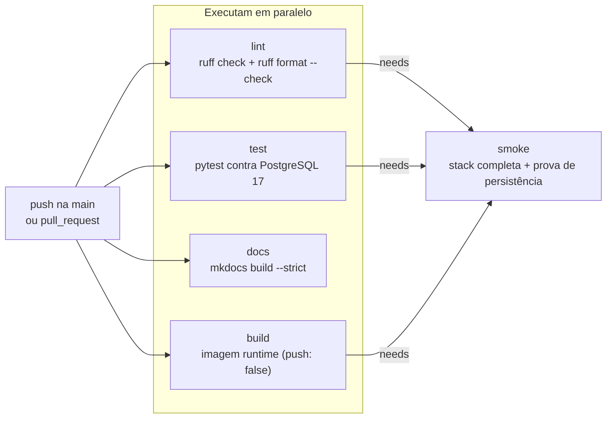

# Pipeline de CI/CD

O repositório tem **três workflows** do GitHub Actions, em `.github/workflows/`. Cada um tem
uma responsabilidade única e um gatilho próprio — nenhum deles faz "tudo":

| Arquivo | Nome exibido | Gatilhos | Para que existe |
| --- | --- | --- | --- |
| `ci.yml` | `CI` | `push` na `main`, `pull_request` para a `main` | Lint, testes com PostgreSQL, build da documentação, build da imagem e smoke test ponta a ponta |
| `publish.yml` | `Publish image` | `push` na `main` e em tags `v*` | Publica a imagem da aplicação no `ghcr.io` |
| `pages.yml` | `Docs` | `push` na `main` **filtrado por caminho**, `workflow_dispatch` | Constrói e publica este site no GitHub Pages |

Três decisões valem para os três arquivos:

- **Runner fixo (`ubuntu-24.04`), não `ubuntu-latest`.** O rótulo `latest` muda de imagem sem
  aviso quando o GitHub promove uma nova versão; um pipeline que hoje passa pode quebrar
  amanhã sem nenhum commit. Fixar a versão torna a troca um commit explícito.
- **Versões de actions fixadas por major** (`actions/checkout@v7`, `docker/build-push-action@v7`
  etc.), pelo mesmo motivo.
- **`timeout-minutes` em todos os jobs.** Sem isso, um job travado (um `docker compose up --wait`
  que nunca fica saudável, por exemplo) ocupa o runner até o limite padrão de 6 horas.

!!! note "Nenhum segredo próprio é necessário"
    O único segredo usado é o `GITHUB_TOKEN`, criado automaticamente para cada execução.
    Não há senha de registry nem `SECRET_KEY` guardada no repositório: a CI usa uma chave
    descartável e o job de smoke gera credenciais aleatórias na hora. Consequência prática:
    a CI funciona em um fork sem nenhuma configuração, e um PR vindo de fork **não consegue**
    publicar imagem — o `publish.yml` só reage a `push`, que exige acesso de escrita.

---

## `ci.yml` — qualidade, testes e a prova de persistência

### Gatilhos, permissões e concorrência

```yaml
on:
  push:
    branches: [main]
  pull_request:
    branches: [main]

permissions:
  contents: read

concurrency:
  group: ci-${{ github.ref }}
  cancel-in-progress: true

env:
  PYTHON_VERSION: "3.13"
```

- **`permissions: contents: read`** aplica o princípio do menor privilégio. Por padrão o
  `GITHUB_TOKEN` pode receber permissões de escrita; aqui ele só consegue ler o repositório.
  Nada neste workflow precisa escrever — nem comentário, nem tag, nem pacote.
- **`concurrency: ci-${{ github.ref }}` com `cancel-in-progress: true`**: o grupo é por *ref*,
  então cada branch/PR tem sua própria fila. Ao empurrar um segundo commit no mesmo PR, a
  execução anterior é cancelada — ela testaria um código que já não existe mais e ainda
  ocuparia um runner por até 20 minutos no job de smoke.
- **`PYTHON_VERSION: "3.13"`** como variável do workflow: é a mesma versão da imagem base
  (`python:3.13-slim` no `Dockerfile`) e o mesmo `target-version = "py313"` configurado para o
  ruff no `pyproject.toml`. Testar em uma versão diferente da que roda em produção é testar
  outra coisa. Note as aspas — sem elas o YAML leria `3.13` como número e a versão poderia
  virar `3.13` → `3.1`.

### O grafo de jobs



Quatro jobs começam ao mesmo tempo; só o `smoke` declara `needs: [lint, test, build]`. A razão
é econômica: o smoke test é o job mais caro (constrói três imagens, sobe a stack inteira, e
depois a derruba e sobe de novo). Não faz sentido pagar por ele se o ruff já reprovou o código
ou se um teste unitário já falhou.

O job `docs` **não** entra no `needs` de propósito: um link quebrado na documentação não
invalida o smoke test da stack, e mantê-lo fora do caminho crítico faz o feedback do site
chegar em ~1 minuto, em paralelo com o resto.

### `lint` — ruff em dois modos

```yaml
- name: ruff check
  run: ruff check .

- name: ruff format --check
  run: ruff format --check .
```

São dois comandos porque são duas verificações diferentes:

- `ruff check` aplica as regras de lint selecionadas no `pyproject.toml`
  (`select = ["E", "F", "I", "UP", "B"]` — pycodestyle, pyflakes, ordenação de imports,
  modernização de sintaxe e bugbear), com `line-length = 100` e `**/migrations/**` excluído,
  já que migrações são geradas pelo Django e não deveriam ser reescritas à mão.
- `ruff format --check` **não formata nada**: compara o arquivo com o que o formatador
  produziria e sai com código diferente de zero se houver divergência. Em CI isso é o certo —
  um job que reescrevesse arquivos no runner descartaria o resultado no fim da execução e
  ainda esconderia o problema.

O job instala `requirements-dev.txt`, que faz `-r requirements.txt` e acrescenta
`pytest`, `pytest-django` e `ruff` — todos com versão exata, para que a CI não quebre sozinha
quando uma nova versão do ruff adicionar uma regra.

### `test` — a suíte contra um PostgreSQL de verdade

```yaml
services:
  postgres:
    image: postgres:17-alpine
    env:
      POSTGRES_DB: upload_stack
      POSTGRES_USER: upload_stack
      POSTGRES_PASSWORD: upload_stack_ci_password
    ports:
      - 5432:5432
    options: >-
      --health-cmd "pg_isready -U upload_stack -d upload_stack"
      --health-interval 5s
      --health-timeout 5s
      --health-retries 10
```

Um **service container** é um container que o runner sobe antes dos steps e derruba no fim.
Dois detalhes importam:

- **`ports: 5432:5432`** publica a porta do serviço no runner. Os steps deste job rodam
  diretamente na máquina do runner (não dentro de um container), então eles **não** enxergam o
  alias de rede `postgres` — por isso o job define `POSTGRES_HOST: localhost`.
- **As opções `--health-*`** fazem o Actions esperar o banco ficar saudável antes do primeiro
  step. Sem elas, o `pytest` bateria em um PostgreSQL que ainda está executando o `initdb` e
  falharia de forma intermitente — o pior tipo de falha de CI.

A imagem é `postgres:17-alpine`, a **mesma** do serviço `db` do `docker-compose.yml`. Testar
contra a mesma versão maior do banco é o que dá valor a este job em relação ao SQLite local.

Os três steps, na ordem, vão do mais barato ao mais caro:

| Step | Comando | O que pega |
| --- | --- | --- |
| Django system checks | `python manage.py check` | Erros de configuração (settings, apps, admin, URLs) — falha em segundos, antes de qualquer teste |
| Migração faltando | `python manage.py makemigrations --check --dry-run` | Um `models.py` alterado **sem** a migração correspondente |
| Testes | `pytest` | O comportamento: upload pela view, gravação em `MEDIA_ROOT`, listagem, rejeição acima do limite e o `/healthz/` |

!!! tip "Por que `makemigrations --check --dry-run` é o step mais subestimado"
    `--dry-run` impede a escrita do arquivo e `--check` faz o comando sair com status ≠ 0
    quando existem mudanças de modelo ainda não migradas. Isso importa muito nesta stack:
    o `entrypoint.sh` roda `migrate --noinput` a cada boot do container. Se alguém alterar um
    campo e esquecer a migração, nada falha no build nem no `up` — o esquema do banco
    simplesmente fica diferente dos modelos, e o erro só aparece em produção, na primeira
    query. Este step transforma esse bug silencioso em um PR vermelho.

O `pytest` usa `DJANGO_SETTINGS_MODULE = "config.settings_test"` (definido em
`[tool.pytest.ini_options]` no `pyproject.toml`). Esse módulo aplica padrões com
`os.environ.setdefault`, que **não sobrescreve** variáveis já existentes — é exatamente por
isso que a mesma suíte roda em SQLite na máquina do dev e em PostgreSQL na CI, sem nenhum
`if` no código: basta o job exportar `DJANGO_DB: postgres` e as `POSTGRES_*`.

### `docs` — `mkdocs build --strict` antes do deploy

```yaml
- name: Install docs dependencies
  run: pip install -r requirements-docs.txt

- name: Build the documentation
  run: mkdocs build --strict
```

`--strict` promove todo *warning* do MkDocs a erro. Somando isso ao bloco `validation:` do
`mkdocs.yml` (`links.not_found`, `links.anchors`, `nav.omitted_files`), um link interno quebrado,
uma âncora inexistente ou uma página fora do `nav` **reprovam o Pull Request**.

O ponto sutil é *onde* essa verificação acontece. Ela roda aqui, na CI de PR, e não apenas no
`pages.yml`: se o único lugar que constrói a documentação fosse o workflow de deploy, o erro
só apareceria depois do merge — com o site fora do ar ou desatualizado e a `main` já suja.
Verificar no PR é mais barato e mantém a `main` sempre publicável.

### `build` — a imagem é construída, mas não empurrada

```yaml
- uses: docker/setup-buildx-action@v4

- name: Build the runtime image
  uses: docker/build-push-action@v7
  with:
    context: .
    target: runtime
    push: false
    tags: django-upload-stack-web:ci
    cache-from: type=gha
    cache-to: type=gha,mode=max
```

`push: false` deixa claro o objetivo: este job responde apenas "o `Dockerfile` ainda
constrói?". Publicar é trabalho do `publish.yml`. Como o `pull_request` roda com
`contents: read`, mesmo um erro de digitação aqui não conseguiria publicar nada.

`target: runtime` é o mesmo estágio usado pelo serviço `web` do `docker-compose.yml` — o
estágio `test` (que instala o pytest) só é construído pelo overlay `docker-compose.test.yml`.

Além da validação, este job **aquece o cache de camadas** que o `smoke` vai reaproveitar logo
em seguida. É por isso que ele é um `needs` do smoke mesmo sem produzir artefato.

### `smoke` — a stack inteira, incluindo a prova do critério de aceite

Este é o job que valida a proposta do projeto. Ele depende de `lint`, `test` e `build`.

**1. Criar o `.env` a partir do exemplo, com segredos aleatórios**

```bash
cp .env.example .env
sed -i "s|^SECRET_KEY=.*|SECRET_KEY=$(openssl rand -hex 32)|" .env
sed -i "s|^POSTGRES_PASSWORD=.*|POSTGRES_PASSWORD=$(openssl rand -hex 16)|" .env
```

O `.env` não está no repositório (está no `.gitignore`), então a CI precisa gerar o seu. Usar
`.env.example` como base tem um efeito colateral excelente: **se alguém adicionar uma variável
obrigatória ao código e esquecer de documentá-la no `.env.example`, o smoke test quebra**. O
exemplo deixa de ser um arquivo decorativo e vira contrato verificado.

`openssl rand -hex` é uma escolha deliberada: a saída contém apenas `0-9a-f`. O Docker Compose
interpola o `.env`, e um valor com `$`, `#`, espaço ou aspas seria silenciosamente mutilado —
o próprio `.env.example` avisa isso no cabeçalho (ver [Variáveis de ambiente](variaveis.md)).
`-hex 32` gera 64 caracteres para a `SECRET_KEY` e `-hex 16` gera 32 para a senha do banco.

**2. Validar o compose antes de gastar tempo com build**

```bash
docker compose config -q
```

`config` resolve `.env`, interpola as variáveis e valida o esquema; `-q` suprime a saída e
mantém apenas o status. Uma variável faltando ou um YAML inválido falham aqui, em segundos, em
vez de no meio de um build de vários minutos.

**3. Subir e esperar ficar saudável**

```bash
docker compose up -d --build --wait --wait-timeout 300
```

`--wait` faz o comando bloquear até que os serviços com healthcheck fiquem `healthy`. Como o
healthcheck do `nginx` passa **pelo proxy** até o `/healthz/` do Django (que por sua vez faz um
`SELECT 1` no banco), o retorno do `--wait` significa que a cadeia inteira responde — sem isso,
o smoke test poderia bater no Nginx enquanto ele ainda está subindo e receber *empty reply*.
O `--wait-timeout 300` cobre o pior caso de um runner frio: build das imagens, `initdb` do
PostgreSQL, `migrate` e `collectstatic` no `entrypoint.sh`.

**4. Rodar o smoke test**

```bash
bash scripts/smoke_test.sh http://localhost:8080
```

O script (`scripts/smoke_test.sh`, também usado localmente) executa seis etapas:

1. `GET /` responde 2xx através do Nginx e `/healthz/` reporta `"database": "ok"`;
2. um `POST` de upload **sem** token CSRF é rejeitado com `403`;
3. o mesmo `POST` **com** o token do cookie, mais `Origin` e `Referer`, retorna `302`;
4. o arquivo aparece na listagem e é servido por `/media/` **byte a byte** (`cmp`);
5. `docker compose down` seguido de `docker compose up -d --wait`;
6. depois da recriação, o registro continua na listagem (volume `postgres_data`) e o arquivo
   continua sendo baixado idêntico (volume `media_data`).

As etapas 5 e 6 são o critério de aceite do trabalho, e é por isso que elas rodam na CI e não
só na máquina do autor: a persistência deixa de ser uma afirmação e passa a ser um teste que
pode ficar vermelho. O nome do arquivo inclui data, hora e PID, para que uma re-execução nunca
case com um resto de execução anterior. Detalhes da demonstração manual estão em
[Persistência e volumes](persistencia.md).

**5. Diagnóstico e limpeza**

```yaml
- name: Dump logs on failure
  if: failure()
  run: |
    docker compose ps -a
    docker compose logs --no-color --tail 200

- name: Tear down
  if: always()
  run: docker compose down -v
```

`if: failure()` só executa quando algum step anterior falhou. Sem esse step, uma falha daria
apenas um "X" vermelho: o runner é descartado e os containers vão junto, levando qualquer
pista. `--no-color` evita sequências ANSI ilegíveis no log do Actions, e `ps -a` inclui
containers que já morreram (um `exit 1` no `entrypoint.sh`, por exemplo).

`if: always()` garante o `down -v` mesmo quando o job falha ou é cancelado. O `-v` remove os
volumes — o que **só pode acontecer depois** do smoke test, já que o passo 6 depende deles.

!!! warning "`down -v` apaga os volumes"
    Este comando existe no workflow porque o runner é efêmero e descartável. **Não copie essa
    linha para a sua máquina** achando que é o jeito normal de parar a stack: `docker compose
    down -v` apaga os uploads e o banco. No dia a dia use `docker compose down`, sem o `-v`.

### Resumo dos jobs

| Job | Runner | `timeout-minutes` | Depende de |
| --- | --- | --- | --- |
| `lint` | `ubuntu-24.04` | 10 | — |
| `test` | `ubuntu-24.04` | 15 | — |
| `docs` | `ubuntu-24.04` | 10 | — |
| `build` | `ubuntu-24.04` | 20 | — |
| `smoke` | `ubuntu-24.04` | 20 | `lint`, `test`, `build` |

---

## Estratégia de cache

São dois caches independentes, com mecanismos diferentes. Ambos importam porque sem eles cada
execução reinstala e reconstrói tudo do zero.

### Cache de dependências Python

```yaml
- uses: actions/setup-python@v7
  with:
    python-version: ${{ env.PYTHON_VERSION }}
    cache: pip
    cache-dependency-path: requirements*.txt
```

`cache: pip` faz a própria `actions/setup-python` cuidar do cache do diretório do pip
(salvar e restaurar, inclusive no fim do job) — não é preciso um `actions/cache` manual.

`cache-dependency-path: requirements*.txt` é a parte que merece atenção: ela define **quais
arquivos entram no hash da chave do cache**. O glob cobre os três arquivos do projeto
(`requirements.txt`, `requirements-dev.txt`, `requirements-docs.txt`), então:

- qualquer alteração em qualquer um deles invalida o cache e força a reinstalação — que é o
  comportamento correto, já que as versões estão fixadas;
- os jobs `lint`, `test`, `docs` (e o `build` do `pages.yml`) compartilham a mesma chave, mesmo
  instalando conjuntos diferentes de pacotes. Um único cache serve a todos.

Sem esse input, o padrão da action é procurar apenas `requirements.txt` na raiz — e uma
mudança em `requirements-dev.txt` não invalidaria o cache, servindo pacotes velhos.

### Cache de camadas do Docker

```yaml
- uses: docker/setup-buildx-action@v4

- uses: docker/build-push-action@v7
  with:
    cache-from: type=gha
    cache-to: type=gha,mode=max
```

**`docker/setup-buildx-action` é obrigatório, não opcional.** O driver padrão do Docker
(`docker`) usa o builder clássico embutido no daemon, que **não suporta** os backends de cache
do BuildKit — com ele, `type=gha` simplesmente não funciona. A action configura um builder com
o driver `docker-container`, que expõe o BuildKit completo, incluindo exportadores de cache.
Por isso ela aparece também no job `smoke` e no `publish.yml`.

**`mode=max` é o detalhe que decide se o cache serve para alguma coisa aqui.** O
`Dockerfile` é multi-stage:

```dockerfile
FROM python:3.13-slim AS builder
RUN python -m venv /opt/venv
COPY requirements.txt ./
RUN pip install --no-cache-dir -r requirements.txt   # <- o passo caro

FROM python:3.13-slim AS runtime
COPY --from=builder /opt/venv /opt/venv              # <- só o resultado chega aqui
```

Com o `mode=min` (o padrão), o BuildKit exporta apenas as camadas da **imagem final**. O
`pip install` vive no estágio `builder`, que não faz parte da imagem final — ele seria
descartado do cache e **reconstruído em toda execução**, que é justamente o passo mais lento do
build. `mode=max` exporta também as camadas dos estágios intermediários, então o `pip install`
só roda de novo quando o `requirements.txt` muda. O preço é um cache maior; o ganho é a única
camada que realmente interessa.

| Cache | Backend | Chave / invalidação | O que evita |
| --- | --- | --- | --- |
| pip | `actions/setup-python` (`cache: pip`) | hash de `requirements*.txt` | Baixar e instalar Django, psycopg, pytest, ruff e MkDocs a cada execução |
| Camadas Docker | GitHub Actions cache (`type=gha`), via buildx | Camadas do BuildKit, incluindo o estágio `builder` por causa do `mode=max` | Refazer o `venv` e o `pip install` da imagem a cada build |

---

## `publish.yml` — publicação da imagem no GHCR

### Gatilhos e permissões

```yaml
on:
  push:
    branches: [main]
    tags: ["v*"]

permissions:
  contents: read
  packages: write

concurrency:
  group: publish-${{ github.ref }}
  cancel-in-progress: false

env:
  REGISTRY: ghcr.io
  IMAGE_NAME: ${{ github.repository }}
```

- **Dois gatilhos**: todo push na `main` publica uma imagem de desenvolvimento, e uma tag
  `v*` publica uma versão. Não há `pull_request` — um PR jamais publica imagem, o que fecha a
  porta para um fork empurrar conteúdo para o registry da conta.
- **`packages: write`** é a única permissão elevada de todo o repositório, e ela é concedida
  só a este workflow. O `contents: read` continua sendo necessário para o `checkout`.
- **`cancel-in-progress: false`**, ao contrário da CI: cancelar um `push` no meio pode deixar
  o registry com um manifesto parcialmente enviado. Publicações são enfileiradas, não abortadas.
- **`IMAGE_NAME: ${{ github.repository }}`** deriva o nome da imagem do próprio repositório
  (`lucasetculbra/django-upload-stack`), então um fork publica no namespace certo sem editar
  nada.

### Login no registry

```yaml
- uses: docker/login-action@v4
  with:
    registry: ${{ env.REGISTRY }}
    username: ${{ github.actor }}
    password: ${{ secrets.GITHUB_TOKEN }}
```

O `ghcr.io` aceita o `GITHUB_TOKEN` da execução como senha — não é preciso criar um Personal
Access Token nem guardar segredo algum. O token expira ao fim da execução e carrega exatamente
as permissões declaradas no bloco `permissions`.

### As regras de tag do `metadata-action`

```yaml
- name: Extract metadata (tags, labels)
  id: meta
  uses: docker/metadata-action@v6
  with:
    images: ${{ env.REGISTRY }}/${{ env.IMAGE_NAME }}
    flavor: |
      latest=false
    tags: |
      type=sha
      type=ref,event=branch
      type=semver,pattern={{version}}
      type=semver,pattern={{major}}.{{minor}}
      type=raw,value=latest,enable={{is_default_branch}}
```

| Regra | Produz | Quando |
| --- | --- | --- |
| `type=sha` | `sha-<7 primeiros caracteres do commit>` | Sempre |
| `type=ref,event=branch` | `main` | Só em push de branch |
| `type=semver,pattern={{version}}` | `1.2.3` | Só em push de tag `v*` |
| `type=semver,pattern={{major}}.{{minor}}` | `1.2` | Só em push de tag `v*` |
| `type=raw,value=latest,enable={{is_default_branch}}` | `latest` | Só quando a ref é a branch padrão |

Na prática, os dois cenários possíveis:

=== "Push na `main` (commit `a1b2c3d…`)"

    ```text
    ghcr.io/lucasetculbra/django-upload-stack:sha-a1b2c3d
    ghcr.io/lucasetculbra/django-upload-stack:main
    ghcr.io/lucasetculbra/django-upload-stack:latest
    ```

    As regras de `semver` não geram nada porque a ref não é uma tag.

=== "Push da tag `v1.2.3`"

    ```text
    ghcr.io/lucasetculbra/django-upload-stack:sha-<commit>
    ghcr.io/lucasetculbra/django-upload-stack:1.2.3
    ghcr.io/lucasetculbra/django-upload-stack:1.2
    ```

    Não há `main` (a ref não é branch) e **não há `latest`**: `{{is_default_branch}}` é falso
    para `refs/tags/v1.2.3`.

**Por que `latest=false`.** O `flavor` padrão é `latest=auto`, que adiciona `latest`
automaticamente quando uma tag semver é gerada — ou seja, publicar a tag `v1.2.3` moveria o
`latest` junto. Isso é ambíguo: `latest` passaria a significar ora "o último commit da `main`",
ora "a última release", dependendo do que foi empurrado por último. Com `latest=false` o
comportamento automático é desligado e o `latest` é controlado por uma única regra explícita,
`type=raw,value=latest,enable={{is_default_branch}}`: **`latest` é sempre o topo da `main`, e
nada mais.** Quem quer uma versão estável usa a tag semver, que é imutável por convenção.

Duas observações sobre o `images`:

- O `metadata-action` **coloca o nome da imagem em minúsculas** automaticamente. Nomes de
  repositório no GitHub podem ter maiúsculas, mas referências Docker não podem — sem esse
  tratamento, um owner como `LucasEtCulbra` produziria uma tag inválida e o push falharia.
- A saída `steps.meta.outputs.labels` traz os rótulos OCI, entre eles
  `org.opencontainers.image.source` apontando para a URL do repositório. É esse rótulo que faz
  o GHCR **ligar o pacote ao repositório**: a página do pacote passa a exibir o README, a
  licença e os commits, e o pacote herda as permissões do repositório.

O último step escreve as tags publicadas no `$GITHUB_STEP_SUMMARY`, para que a página da
execução mostre exatamente o que foi publicado sem precisar abrir o log.

### Primeira publicação: o pacote nasce privado

!!! warning "Um `docker pull` sem login falha até você tornar o pacote público"
    Um pacote criado no GHCR pela primeira vez é **privado**, mesmo que o repositório seja
    público. O workflow fica verde, a imagem existe, e ainda assim qualquer pessoa que tentar
    baixá-la recebe `denied` ou `unauthorized`.

    A correção é manual e só precisa ser feita uma vez: no GitHub, abra o perfil/organização →
    aba **Packages** → o pacote `django-upload-stack` → **Package settings** →
    **Danger Zone** → **Change visibility** → **Public**.

Depois disso:

```bash
docker pull ghcr.io/lucasetculbra/django-upload-stack:latest
```

E para rodar a stack com a imagem pronta, sem construir nada localmente (o `docker-compose.yml`
lê `image: ${WEB_IMAGE:-django-upload-stack-web:local}`):

=== "Git Bash"

    ```bash
    WEB_IMAGE=ghcr.io/lucasetculbra/django-upload-stack:latest docker compose up -d
    ```

=== "PowerShell"

    ```powershell
    $env:WEB_IMAGE = "ghcr.io/lucasetculbra/django-upload-stack:latest"
    docker compose up -d
    ```

---

## `pages.yml` — build e deploy deste site

### Gatilho filtrado por caminho

```yaml
on:
  push:
    branches: [main]
    paths:
      - docs/**
      - mkdocs.yml
      - requirements-docs.txt
      - .github/workflows/pages.yml
  workflow_dispatch:
```

O site só é reconstruído quando algo que o afeta muda. Um commit que só toca em `uploads/views.py`
não dispara um deploy — e o deploy do Pages é serializado, então evitar execuções inúteis evita
fila. O `workflow_dispatch` permite disparar manualmente (pela aba Actions ou com
`gh workflow run pages.yml`), o que é necessário, por exemplo, logo depois de habilitar o Pages
nas configurações, quando não há nenhum commit novo para empurrar.

A validação da documentação não depende deste filtro: o job `docs` do `ci.yml` roda
`mkdocs build --strict` em **todo** PR.

### Build e deploy separados, com permissões separadas

```yaml
permissions:
  contents: read

concurrency:
  group: pages
  cancel-in-progress: false
```

```yaml
jobs:
  build:
    steps:
      - uses: actions/checkout@v7
      - uses: actions/setup-python@v7          # cache: pip, requirements*.txt
      - run: pip install -r requirements-docs.txt
      - uses: actions/configure-pages@v6
      - run: mkdocs build --strict
      - uses: actions/upload-pages-artifact@v5
        with:
          path: site

  deploy:
    needs: build
    permissions:
      pages: write
      id-token: write
    environment:
      name: github-pages
      url: ${{ steps.deployment.outputs.page_url }}
    steps:
      - uses: actions/deploy-pages@v5
        id: deployment
```

- **Por que dois jobs.** O `build` roda o código do repositório (instala dependências, executa
  o MkDocs) com apenas `contents: read`. O `deploy` não executa código do projeto — só publica
  o artefato — e é o único que recebe `pages: write`. Se uma dependência de documentação for
  comprometida, ela roda em um job que não tem permissão de publicar nada.
- **`id-token: write`** é obrigatório porque a `actions/deploy-pages` autentica o deployment
  via OIDC, e sem esse escopo a execução falha pedindo o token de identidade.
- **`concurrency: group: pages` com `cancel-in-progress: false`.** O grupo **não** inclui
  `${{ github.ref }}`, de propósito: existe um único site, e o GitHub Pages aceita um
  deployment por vez. Cancelar um deploy em andamento poderia deixar o site publicado pela
  metade; a escolha aqui é enfileirar.
- **`environment: github-pages`** é o ambiente exigido pela `deploy-pages`. Ele registra o
  deployment no GitHub (com link para a URL publicada, vinda de `steps.deployment.outputs.page_url`)
  e permite regras de proteção, como exigir aprovação manual, sem tocar no workflow.

### O input `enablement` está ausente de propósito

!!! danger "O Pages precisa ser habilitado uma vez, na mão"
    A `actions/configure-pages` aceita um input `enablement: true` que tentaria habilitar o
    GitHub Pages via API. **Ele não funciona com o `GITHUB_TOKEN` padrão**: criar um site do
    Pages exige permissão de administrador do repositório, que o token da execução não tem.
    O resultado é uma falha do tipo `Resource not accessible by integration`, com o workflow
    vermelho por um motivo que não está no código.

    Por isso ele foi omitido e o Pages é habilitado **uma única vez**, por qualquer um destes
    caminhos:

    - **Settings → Pages → Build and deployment → Source: `GitHub Actions`**; ou
    - pela API, com o `gh` CLI autenticado como o dono do repositório:

    ```bash
    gh api --method POST repos/lucasetculbra/django-upload-stack/pages -f build_type=workflow
    ```

    Detalhe de ordem: **não é possível habilitar o Pages em um repositório vazio**. O passo
    acontece depois do primeiro push. Se o workflow rodar antes disso, ele falha no step
    "Configure Pages" — basta habilitar e disparar de novo com `workflow_dispatch`.

---

## Badges do README

O `README.md` exibe três badges de status, um por workflow:

```markdown
[](https://github.com/lucasetculbra/django-upload-stack/actions/workflows/ci.yml)
[](https://github.com/lucasetculbra/django-upload-stack/actions/workflows/publish.yml)
[](https://github.com/lucasetculbra/django-upload-stack/actions/workflows/pages.yml)
```

O padrão da URL é
`https://github.com/<owner>/<repo>/actions/workflows/<arquivo>/badge.svg`.

!!! note "O badge é indexado pelo **nome do arquivo**, não pelo `name:` do workflow"
    Renomear `ci.yml` quebra o badge (ele passa a mostrar "no status"), mesmo que o
    `name: CI` dentro do arquivo continue igual. O contrário também vale: mudar o `name:`
    não afeta o badge, apenas o rótulo exibido na aba Actions.

    O `?branch=main` restringe o status à branch padrão; sem ele, o badge mostraria o
    resultado da execução mais recente em qualquer branch — inclusive uma experiência quebrada
    em um branch de trabalho.

    Por causa do filtro de caminhos do `pages.yml`, o badge "Docs" reflete a última execução
    *que aconteceu*: depois de vários commits que não tocam na documentação, ele continua
    verde por uma execução antiga. Isso é correto — nada mudou — mas convém saber.

Os outros dois badges (`docs-GitHub Pages` e `license-MIT`) são estáticos, do shields.io, e não
refletem estado de execução.

---

## Acompanhando e depurando execuções

### Com o `gh` CLI

Os comandos são idênticos no PowerShell e no Git Bash (basta ter o
[GitHub CLI](https://cli.github.com/) instalado e autenticado com `gh auth login`):

```bash
# últimas execuções da CI na main
gh run list --workflow=ci.yml --branch main --limit 5

# acompanhar a execução mais recente até o fim;
# --exit-status faz o comando sair com código != 0 se a execução falhar
gh run watch --exit-status

# apenas os logs dos steps que falharam - o atalho mais útil de todos
gh run view <run-id> --log-failed

# log completo de um job específico
gh run view <run-id> --job=<job-id> --log

# reexecutar somente os jobs que falharam (útil para falha transitória de rede)
gh run rerun <run-id> --failed

# disparar manualmente o deploy da documentação (workflow_dispatch)
gh workflow run pages.yml
```

O `--exit-status` é o que torna o `gh run watch` útil em script: `gh run watch --exit-status`
seguido de `gh run view --log-failed` dá o diagnóstico completo em dois comandos, sem abrir o
navegador.

!!! tip "Fluxo recomendado quando o `smoke` fica vermelho"
    `gh run view <run-id> --log-failed` já traz o step "Dump logs on failure", ou seja, o
    `docker compose ps -a` e as últimas 200 linhas de log dos três containers. Na maioria das
    vezes a causa aparece aí sem precisar reproduzir nada localmente. Os sintomas mais comuns
    (502, 403 de CSRF, 413, `permission denied` na mídia) estão catalogados em
    [Troubleshooting](troubleshooting.md).

### Pelos endpoints REST públicos

Como o repositório é público, os metadados das execuções podem ser lidos sem autenticação:

| Endpoint (prefixo `https://api.github.com/repos/lucasetculbra/django-upload-stack`) | Retorna |
| --- | --- |
| `/actions/workflows` | Os três workflows, com `id` e `state` |
| `/actions/workflows/ci.yml/runs?branch=main&per_page=5` | As últimas execuções da CI na `main` |
| `/actions/runs/<run_id>` | Uma execução: `status`, `conclusion`, `head_sha`, horários |
| `/actions/runs/<run_id>/jobs` | Os jobs da execução e o resultado de cada step |

=== "Git Bash"

    ```bash
    curl -s "https://api.github.com/repos/lucasetculbra/django-upload-stack/actions/workflows/ci.yml/runs?branch=main&per_page=3"
    ```

=== "PowerShell"

    ```powershell
    # no PowerShell, "curl" é alias de Invoke-WebRequest: use curl.exe
    curl.exe -s "https://api.github.com/repos/lucasetculbra/django-upload-stack/actions/workflows/ci.yml/runs?branch=main&per_page=3"
    ```

!!! note "Logs não são públicos"
    Os metadados acima são acessíveis sem token, mas o endpoint de download dos logs
    (`/actions/runs/<run_id>/logs`) **exige autenticação**. Para ler log, use o `gh` CLI (que
    já cuida do token) ou a interface web do GitHub.

---

## Um trade-off assumido: `publish.yml` não espera a CI

Em um push na `main`, `ci.yml` e `publish.yml` começam **ao mesmo tempo**. Não há `needs` nem
`workflow_run` entre eles — são workflows independentes reagindo ao mesmo evento. A consequência
é direta e vale registrar com honestidade:

!!! warning "Um commit que reprova nos testes ainda publica imagem"
    Se o `pytest` falhar em um push na `main`, o `publish.yml` provavelmente já terá empurrado
    `sha-<commit>`, `main` e `latest` para o GHCR antes da CI terminar. O `latest` passa a
    apontar para um commit quebrado.

Esse é o formato pedido pelo enunciado do trabalho — os workflows são independentes e cada um
faz uma coisa — e ele tem um mérito real: a publicação não fica refém de um teste instável, e
o feedback dos dois caminhos chega em paralelo. Duas circunstâncias reduzem o dano: a tag
`sha-<commit>` identifica exatamente de qual commit cada imagem veio (dá para voltar para a
anterior com um `docker pull` preciso), e um push de correção reposiciona o `latest`.

As alternativas mais rigorosas, se o projeto fosse para produção:

| Alternativa | Como | Custo |
| --- | --- | --- |
| Job de publish dentro do `ci.yml` | Um job `publish` com `needs: [lint, test, build]` e `if: github.event_name == 'push'` | Junta responsabilidades em um arquivo só e exige `packages: write` no workflow inteiro |
| `workflow_run` | `on: workflow_run: workflows: [CI], types: [completed]` + `if: github.event.workflow_run.conclusion == 'success'` | O workflow roda no contexto da branch padrão; é preciso fazer o checkout explícito do `head_sha` certo |
| Branch protection | Exigir os checks da CI como *required status checks* para dar merge na `main` | Não cobre push direto na `main` por quem tem permissão de administrador |

A terceira é a que ataca a causa: com PR obrigatório e checks obrigatórios, um commit reprovado
nunca chega na `main` — e então a ordem entre publicar e testar deixa de importar tanto.

---

## Reproduzindo cada job localmente

Antes de empurrar, dá para rodar exatamente o mesmo que a CI roda. Os comandos Python assumem
Python 3.13+ com as dependências instaladas (`pip install -r requirements-dev.txt`).

| Job da CI | Comando equivalente na sua máquina | Observação |
| --- | --- | --- |
| `lint` | `ruff check .` e `ruff format --check .` | Mesma configuração do `pyproject.toml`; use `ruff format .` (sem `--check`) para corrigir |
| `test` (rápido) | `pytest` | Roda em SQLite, pelo `config.settings_test`; é o que a maioria dos erros pega |
| `test` (fiel à CI) | `docker compose -f docker-compose.yml -f docker-compose.test.yml run --rm web` | A mesma suíte contra o PostgreSQL 17 real, dentro do container |
| `test` (migração faltando) | `python manage.py makemigrations --check --dry-run` | Sai com erro se algum modelo mudou sem migração |
| `docs` | `pip install -r requirements-docs.txt` e `mkdocs build --strict` | `mkdocs serve` dá o mesmo rigor com recarga automática |
| `build` | `docker build --target runtime -t django-upload-stack-web:ci .` | Ou `docker compose build web`, que usa o mesmo `target` |
| `smoke` (validação) | `docker compose config -q` | Valida `.env` + YAML sem subir nada |
| `smoke` (completo) | `docker compose up -d --build --wait --wait-timeout 300` e depois `bash scripts/smoke_test.sh` | No Windows, rode o script pelo **Git Bash**: ele usa `bash`, `cmp` e `/dev/urandom` |

!!! tip "Diferença entre o seu `.env` e o da CI"
    A CI gera um `.env` novo a partir do `.env.example` a cada execução; a sua máquina usa o
    `.env` que você criou uma vez. Se o smoke test passa localmente e falha na CI, a primeira
    hipótese é uma variável que existe só no seu `.env` e nunca foi adicionada ao
    `.env.example`. A referência completa está em [Variáveis de ambiente](variaveis.md), e o
    passo a passo da primeira execução em [Instalação e execução](instalacao.md).
