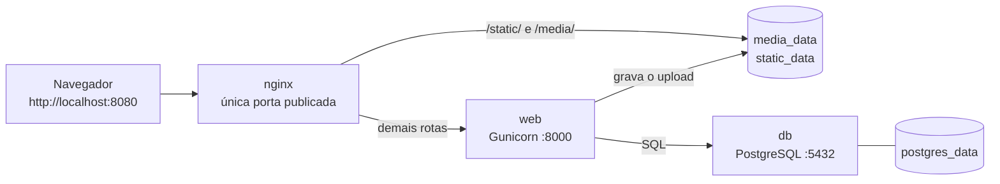

# Visão geral

O **django-upload-stack** é uma stack Docker Compose completa para uma aplicação Django que
recebe upload de arquivos: **Nginx** como proxy reverso e único ponto de entrada,
**Gunicorn** servindo o Django e **PostgreSQL** como banco de dados. Os arquivos enviados
pelos usuários e os arquivos estáticos coletados ficam em **volumes nomeados**, de modo que
nada é perdido quando os contêineres são destruídos e recriados.

O aplicativo em si é deliberadamente pequeno — um formulário que aceita um arquivo, grava o
registro no PostgreSQL e lista os envios anteriores. O objeto de estudo não é o formulário,
e sim **a infraestrutura em volta dele**.

!!! tip "O critério de aceite em uma frase"
    Depois de `docker compose down` seguido de `docker compose up -d`, o arquivo enviado
    continua sendo baixado byte a byte e o registro continua aparecendo na listagem.
    A demonstração passo a passo está em [Persistência e volumes](persistencia.md).

## O problema que esta stack resolve

Uma aplicação Django que recebe uploads e é executada com `python manage.py runserver`
acumula quatro problemas de uma vez. Cada serviço da stack existe para resolver um deles.

**1. `runserver` não é um servidor de produção.**
Ele é single-threaded por padrão, não foi escrito pensando em segurança nem em desempenho e
a própria documentação do Django diz para não usá-lo em produção. A stack usa **Gunicorn**,
um servidor WSGI de verdade, com 3 workers e timeout de 120 s:

```bash
gunicorn config.wsgi:application --bind 0.0.0.0:8000 --workers 3 --timeout 120 \
    --access-logfile - --error-logfile -
```

Os logs vão para stdout/stderr (`-`) porque em contêiner quem coleta log é o runtime, não um
arquivo dentro do sistema de arquivos efêmero.

**2. Servir mídia e estáticos pelo Python é desperdício.**
Com `DEBUG=0` o Django simplesmente **não serve** `/media/` nem `/static/` — e mesmo que
servisse, cada byte de um arquivo de 80 MB passaria por um worker do Gunicorn, que ficaria
bloqueado e indisponível para requisições reais. No **Nginx** esses dois prefixos são
resolvidos direto do disco, com cache (`expires 1h` para mídia, `7d` para estáticos) e sem
encostar no Python. Além disso, o Nginx é o **único serviço com porta publicada no host**
(8080): Gunicorn e PostgreSQL só existem dentro da rede interna `backend`, o que reduz a
superfície exposta a exatamente uma porta.

**3. SQLite em arquivo não é um banco para múltiplos processos.**
Com 3 workers do Gunicorn escrevendo no mesmo arquivo, `database is locked` deixa de ser
hipótese. A stack usa **PostgreSQL 17** em um serviço próprio, com healthcheck, e o
`web` só sobe depois que o banco responde (`depends_on: condition: service_healthy`).

**4. Contêiner é efêmero — e é aqui que a maioria das stacks falha.**
A camada gravável de um contêiner morre junto com ele. Se `MEDIA_ROOT` apontar para um
diretório comum dentro do contêiner, todo upload desaparece no primeiro `docker compose down`,
e o mesmo vale para o `PGDATA` do PostgreSQL. Por isso os três diretórios com estado são
volumes nomeados:

| Volume | Montado em | Guarda |
| --- | --- | --- |
| `media_data` | `/app/media` (web) e `/vol/media` (nginx, `:ro`) | arquivos enviados pelos usuários |
| `static_data` | `/app/staticfiles` (web) e `/vol/static` (nginx, `:ro`) | resultado do `collectstatic` |
| `postgres_data` | `/var/lib/postgresql/data` (db) | dados do PostgreSQL |

!!! note "Por que o Nginx monta os volumes como `:ro`"
    Quem grava é a aplicação; o Nginx só lê. Montar somente leitura torna impossível que uma
    falha de configuração do proxy transforme o diretório de mídia em área de escrita — e
    documenta a intenção diretamente no `docker-compose.yml`.

## O que a stack entrega

- **Ponto de entrada único**: só o Nginx publica porta no host (`8080` por padrão, via `NGINX_PORT`).
- **Persistência real**: uploads, estáticos e banco sobrevivem a `down` + `up` (ver [Persistência e volumes](persistencia.md)).
- **Imagem multi-stage**: a venv é construída em um estágio `builder` e copiada para o estágio `runtime`, que não carrega ferramentas de build; o processo roda como usuário não-root (`uid/gid 1000`).
- **Inicialização automatizada**: o `entrypoint.sh` espera o PostgreSQL aceitar conexão, roda `migrate --noinput`, roda `collectstatic --noinput --clear` e só então executa o Gunicorn.
- **Healthchecks encadeados**: `db` (via `pg_isready`), `web` (via `/healthz/`, que executa um `SELECT 1` no banco) e `nginx` (via `/healthz/` **através do proxy**) — ou seja, `nginx` saudável significa que a cadeia inteira responde.
- **Configuração 100 % por ambiente**: `SECRET_KEY`, `DEBUG`, `ALLOWED_HOSTS`, `CSRF_TRUSTED_ORIGINS`, credenciais e limites vêm do `.env` (ver [Variáveis de ambiente](variaveis.md)).
- **Limite de upload coerente nas duas pontas**: `MAX_UPLOAD_MB=100` no Django e `client_max_body_size 100M` no Nginx, para que o proxy não devolva 413 em algo que a aplicação aceitaria — e vice-versa.
- **Mídia tratada como conteúdo não confiável**: o Nginx devolve os arquivos de `/media/` com `X-Content-Type-Options: nosniff`, `Content-Security-Policy: default-src 'none'; sandbox` e `Content-Disposition: attachment`.
- **CI completa**: lint (ruff), testes com PostgreSQL, build da imagem, build da documentação com `mkdocs build --strict` e um smoke test end-to-end que sobe a stack, envia um arquivo, derruba tudo e confere se o arquivo continua lá (ver [CI/CD](ci-cd.md)).

## Os três serviços

| Serviço | Contêiner | Imagem | Papel | Porta |
| --- | --- | --- | --- | --- |
| `db` | `dus-db` | `postgres:17-alpine` | Banco de dados; guarda os metadados de cada upload | Nenhuma publicada — `5432` só na rede `backend` |
| `web` | `dus-web` | build local (`target: runtime`, base `python:3.13-slim`); tag `${WEB_IMAGE:-django-upload-stack-web:local}` | Django + Gunicorn; grava os arquivos em `/app/media` | `expose: 8000` — visível apenas para o Nginx |
| `nginx` | `dus-nginx` | build local a partir de `nginx:1.30-alpine` | Proxy reverso e entrega direta de `/media/` e `/static/` | **`${NGINX_PORT:-8080}:80`** — a única publicada no host |

!!! warning "Não publique a porta do PostgreSQL"
    É tentador adicionar `ports: ["5432:5432"]` ao serviço `db` para inspecionar o banco com
    um cliente gráfico. Isso expõe o PostgreSQL na sua rede local com a senha que está no
    `.env`. Prefira `docker compose exec db psql -U upload_stack -d upload_stack`, que não
    abre porta nenhuma.

## Fluxo de uma requisição



Em resumo: o navegador só conversa com o Nginx. Requisições de `/static/` e `/media/` param
ali mesmo e são respondidas a partir dos volumes; qualquer outra rota é encaminhada para o
Gunicorn, que fala com o PostgreSQL e grava os arquivos no volume de mídia — o mesmo que o
Nginx lê. O diagrama detalhado, com cabeçalhos de proxy, ordem de inicialização e o caminho
completo de um `POST`, está em [Arquitetura](arquitetura.md).

## Começar agora

Pré-requisito: Docker Desktop (ou Docker Engine) com o plugin **Compose v2**.

**1. Clonar o repositório**

```bash
git clone https://github.com/lucasetculbra/django-upload-stack.git
cd django-upload-stack
```

**2. Criar o `.env` a partir do exemplo**

=== "PowerShell"

    ```powershell
    Copy-Item .env.example .env
    ```

=== "Git Bash"

    ```bash
    cp .env.example .env
    ```

Abra o `.env` e troque o `SECRET_KEY` por um valor único — o `config/settings.py` levanta
`ImproperlyConfigured` se ele estiver vazio, e o valor do exemplo é público:

```bash
python -c "import secrets; print(secrets.token_urlsafe(50))"
```

!!! warning "Valores do `.env` não aceitam `$`, `#` nem espaços"
    O arquivo é interpolado pelo Docker Compose, que trataria `$` como início de variável e
    `#` como início de comentário — a senha entraria no contêiner truncada, e o erro só
    apareceria como uma falha de autenticação no PostgreSQL.

**3. Subir a stack**

```bash
docker compose up -d --build
```

Na primeira execução o build do Python leva alguns minutos e o `entrypoint.sh` ainda precisa
esperar o PostgreSQL, aplicar as migrações e rodar o `collectstatic`. Como os três serviços
têm healthcheck, dá para pedir ao Compose que só devolva o prompt quando tudo estiver
saudável:

```bash
docker compose up -d --build --wait --wait-timeout 300
```

**4. Abrir a aplicação**

Acesse <http://localhost:8080> e envie um arquivo. Para conferir a stack pela linha de
comando:

=== "PowerShell"

    ```powershell
    curl.exe -fsS http://localhost:8080/healthz/
    ```

=== "Git Bash"

    ```bash
    curl -fsS http://localhost:8080/healthz/
    ```

O endpoint `/healthz/` executa um `SELECT 1` e responde com um JSON contendo `status`,
`database` e `vendor` — é o mesmo teste usado pelos healthchecks do `web` e do `nginx`.

!!! note "No PowerShell use sempre `curl.exe`"
    No PowerShell, `curl` é um *alias* para `Invoke-WebRequest`, que não entende as flags do
    cURL (`-fsS`, `-F`, `-o`...). Chamar `curl.exe` explicitamente garante o cURL de verdade,
    que acompanha o Windows 10/11.

O passo a passo completo — incluindo o primeiro upload, a criação do superusuário para o
`/admin/` e como parar a stack sem destruir os dados — está em
[Instalação e execução](instalacao.md).

## Stack técnica

Tudo é fixado em versão exata para que o build de hoje seja igual ao de daqui a seis meses.

| Componente | Versão | Onde está declarado |
| --- | --- | --- |
| Django | `5.2.17` | `requirements.txt` |
| psycopg (binary) | `3.3.6` | `requirements.txt` |
| Gunicorn | `26.2.0` | `requirements.txt` |
| Python (imagem base) | `python:3.13-slim` | `Dockerfile` |
| PostgreSQL | `postgres:17-alpine` | `docker-compose.yml` |
| Nginx | `nginx:1.30-alpine` | `nginx/Dockerfile` |

Ferramentas de desenvolvimento e CI, em `requirements-dev.txt`: `pytest==9.1.1`,
`pytest-django==4.14.0` e `ruff==0.16.8` (configurado no `pyproject.toml` com
`line-length = 100` e as regras `E`, `F`, `I`, `UP`, `B`). A documentação que você está lendo
é gerada com `mkdocs-material==9.7.7` e `pymdown-extensions==11.0.2`, listados em
`requirements-docs.txt`.

A imagem da aplicação também é publicada automaticamente a cada push na `main` em
[`ghcr.io/lucasetculbra/django-upload-stack`](https://github.com/lucasetculbra/django-upload-stack/pkgs/container/django-upload-stack),
com tags `latest`, o SHA do commit, o nome do branch e, em tags `v*`, a versão semântica.
Para usá-la no lugar do build local, basta definir `WEB_IMAGE` no `.env` — detalhes em
[CI/CD](ci-cd.md).

!!! danger "O `.env` nunca entra na imagem nem no Git"
    `.env` e `.env.*` estão no `.dockerignore` e no `.gitignore`. Segredo em imagem é segredo
    vazado: qualquer pessoa com acesso ao registry pode extrair o arquivo com
    `docker cp`. Versionado fica apenas o `.env.example`, com valores de exemplo.

## Próximos passos

- [Arquitetura](arquitetura.md) — o caminho completo de uma requisição, os cabeçalhos de proxy, a ordem de inicialização e o porquê de cada decisão de rede.
- [Instalação e execução](instalacao.md) — pré-requisitos, primeiro upload, superusuário do `/admin/`, comandos do dia a dia e execução dos testes.
- [Docker Compose e Dockerfile](docker-compose.md) — leitura linha a linha dos arquivos: build multi-stage, usuário não-root, healthchecks, `depends_on` e o overlay `docker-compose.test.yml`.
- [Persistência e volumes](persistencia.md) — **a demonstração do critério de aceite**: enviar um arquivo, executar `down` + `up` e provar que ele continua lá; também explica a diferença entre `down` e `down -v`, e como fazer backup dos volumes.
- [Variáveis de ambiente](variaveis.md) — referência de cada variável do `.env`, valores padrão, quais são obrigatórias e quais precisam andar em par (como `MAX_UPLOAD_MB` e `client_max_body_size`).
- [CI/CD](ci-cd.md) — os workflows `ci.yml`, `publish.yml` e `pages.yml`: lint, testes, build da imagem, smoke test end-to-end, publicação no GHCR e deploy deste site.
- [Troubleshooting](troubleshooting.md) — 502 no Nginx, 403 de CSRF, 413 em uploads grandes, `permission denied` ao gravar mídia e o que fazer quando o `web` não sobe.
